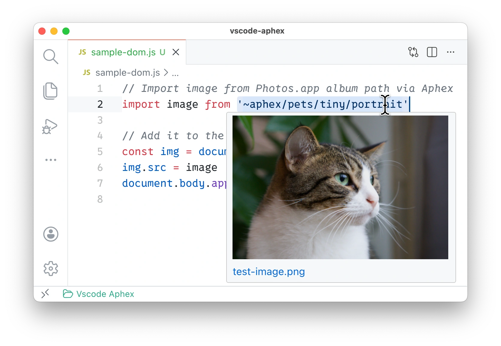

<!-- title({ titleCase: true, prefix: "VS Code ", postfix: " Extension" }) -->

# VS Code Aphex Preview Extension

<!-- /title -->

<!-- badges({
  npm: [],
  custom: {
    "Visual Studio Marketplace Version": {
      image: "https://img.shields.io/badge/dynamic/json?url=https%3A%2F%2Fraw.githubusercontent.com%2Fkitschpatrol%2Fvscode-aphex-preview%2Frefs%2Fheads%2Fmain%2Fpackage.json&query=version&label=VS%20Code%20Marketplace",
      link: "https://marketplace.visualstudio.com/items?itemName=kitschpatrol.aphex-preview",
    },
  }
}) -->

[](https://opensource.org/licenses/MIT)
[](https://github.com/kitschpatrol/vscode-aphex-preview/actions/workflows/ci.yml)
[](https://marketplace.visualstudio.com/items?itemName=kitschpatrol.aphex-preview)

<!-- /badges -->

<!-- short-description -->

**Thumbnail preview images on hover for @kitschpatrol/unplugin-aphex URLs.**

<!-- /short-description -->

## Getting started

_Let's assume you have [VS Code](https://code.visualstudio.com) installed and are working in a project using the [unplugin-aphex](https://github.com/kitschpatrol/unplugin-aphex) build tool plugin to integrate photos from your local Apple Photos.app library into your build pipeline._

Install the extension from the [Marketplace](https://marketplace.visualstudio.com/items?itemName=kitschpatrol.aphex-preview), or run the following in VS Code's command palette:

```sh
ext install kitschpatrol.aphex-preview
```

Now, when you hover over an Aphex-style link in your code, you should see a live preview thumbnail of the referenced photo.



For now, this extension does not itself resolve or fetch images; it only provides thumbnail previews for cached Aphex URLs that have already been resolved by [unplugin-aphex](https://github.com/kitschpatrol/unplugin-aphex) via [aphex](https://github.com/kitschpatrol/aphex).

## Configuration

The extension provides the following settings:

| Setting                      | Default                                              | Description                               |
| ---------------------------- | ---------------------------------------------------- | ----------------------------------------- |
| `aphex-preview.manifestPath` | `node_modules/.cache/aphex/.aphex-plugin-cache.json` | Path to the Aphex cache manifest file     |
| `aphex-preview.maxWidth`     | `300`                                                | Maximum width for image previews (points) |

## Supported file types

Hover previews work in the following file types: JavaScript, TypeScript, JSX, TSX, Markdown, MDX, HTML, Astro, and Svelte.

## Maintainers

[kitschpatrol](https://github.com/kitschpatrol)

<!-- contributing -->

## Contributing

[Issues](https://github.com/kitschpatrol/vscode-aphex-preview/issues) are welcome and appreciated.

Please open an issue to discuss changes before submitting a pull request. Unsolicited PRs (especially AI-generated ones) are unlikely to be merged.

This repository uses [@kitschpatrol/shared-config](https://github.com/kitschpatrol/shared-config) (via its `ksc` CLI) for linting and formatting, plus [MDAT](https://github.com/kitschpatrol/mdat) for readme placeholder expansion.

<!-- /contributing -->

<!-- license -->

## License

[MIT](LICENSE.txt) © [Eric Mika](https://ericmika.com)

<!-- /license -->
